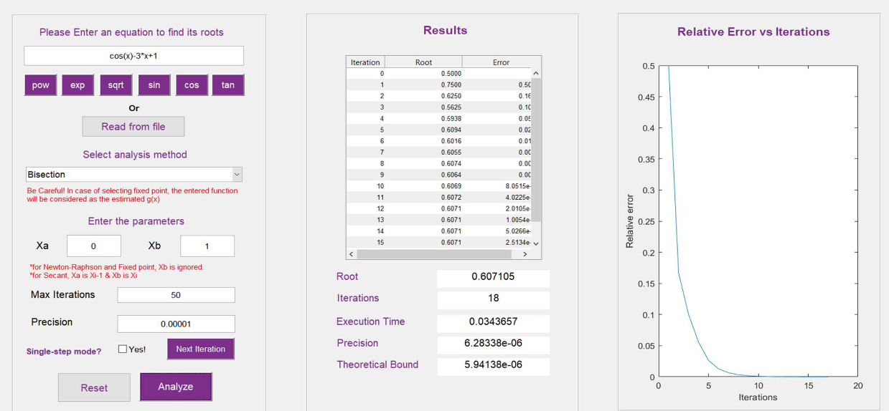
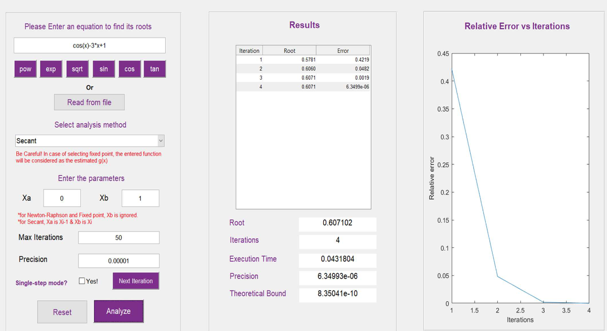

# Non-Linear Equations Analysis With Matlab 🔢📈

The project involves using Matlab to analyze non-linear equations. The aim is to gain a deeper understanding of the equations by using computer-aided numerical analysis and visualizing the results through graphs and charts.

## Explaination 📖

### Why we need numerical analysis?

Non-linear equations are commonly found in many real-world phenomena, such as in the fields of physics, biology, economics, and more. These equations are often too complex to be solved analytically, and therefore, numerical analysis is needed to understand their behavior.

A project analyzing non-linear equations using Matlab provides the ability to study the equations in greater detail, identify patterns and relationships, and make predictions about their behavior. This is useful in many applications, such as understanding complex systems, making informed decisions, and developing new technologies.

### Numerical Methods to solve equations 🚀

- Bisection
- False Postion
- Fixed Point
- Newton-Raphson
- Secant

### Code Need to Know 📊

> You can find the implementation of each code and it's psuedocode in the report

## Demo Example :test_tube:

Using Bisection Method

Using Secant Method

* Further Cases can be found in the report associated with the project. Feel free to expriment yourself or add other Demos.

## Table of contents :label:

| File Name                                                                                                           | Description                                                       |
| ------------------------------------------------------------------------------------------------------------------- | ----------------------------------------------------------------- |
| [Report.pdf](https://github.com/XMaroRadoX/Non-Linear-Equations-Analysis-With-Matlab/blob/master/Report.pdf) | Contains the psuedocode,it's implementation,and running cases with various functions. |
| [techinques.m](https://github.com/XMaroRadoX/Non-Linear-Equations-Analysis-With-Matlab/blob/master/techniques.m) | Contains matlab code of functions implementation. |
| [v1.m](https://github.com/XMaroRadoX/Non-Linear-Equations-Analysis-With-Matlab/blob/master/v1.m)             | Contains matlab code of Visuals.                                          |

### Pre-requisites :screwdriver:

- Matlab

### Run :green_circle:

- Open Directory in matlab
- Run The Figure

### Licensing :pencil:

This code is licensed under the MIT License.

### Authors :pen:

- Marwan Radwan
- Mariam Atef Hassan
- Sarah Sherien Abdel-Fattah
- Yasmine Emad

### Contribution :clinking_glasses:

Feel free to contribute just make a pull request and do what you wish. 😼

